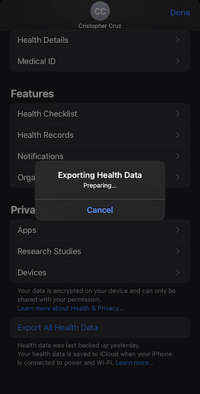

# Exporting Apple Health app data using Python

The apple fitness and health apps do a great job of storing and displaying your information within the application. What if you wanted to do take your data, like your workouts logged for the year, and publish it on your website/platform ? 

First we need to do the following: 

        1. Open the Health app on your iPhone
        2. Click on the Account icon and scroll down to "Export All Health Data"
        3. Send the "export.zip" file you just downloaded to your computer and extract



This export file will contain the following : 

        export.xml
        export_cda.xml
        workout-routes

***export.xml*** is the one we need. This file will contain lots of data and may take time to load.


# XML 


Opening the file can be alarming as there are thousands of lines of data, but we can browse the file to take a closer look at how the elements are stored. This will help us with knowing how to refer to the elements we want to extract later. Here our element of interest is the "Workout" element and its contents


# HealthKit :

If you are curious or uncertain about a particular element or attribute, you can browse through the [HealthKit documentation](https://developer.apple.com/documentation/healthkit) for more details :


https://developer.apple.com/documentation/healthkit/hkworkouttype


# Python :

To extract the desired data, we can utilize Python's powerful capabilities and leverage its rich collection of frameworks, including the highly useful pandas library for efficient data analysis:
```python
import datetime
import pandas as pd
import xml.etree.ElementTree as ET
```

We can then parse the XML file using the ElementTree module. Make sure to specify the correct path/location of to your export.xml file 
```python
tree = ET.parse('data/export.xml')
root = tree.getroot()
```

Next we iterate throught the target elements. You can add/remove fields according to your usecase. Here we are iterating through the 'Workout' elements and storing 'type', 'startDate', 'Duration'
```python
data = []
# Iterate over the 'Workout' elements
for workout in root.iter('Workout'):
    creation_date = pd.to_datetime(workout.attrib['creationDate']).tz_convert(None)

    # Getting data for the year 2023 exclusively
    if creation_date.year == 2023:
        workout_data = {}
        
        # Store data + proper type conversion for dates and numeric values
        workout_data['type'] = workout.attrib['workoutActivityType']
        start_date = pd.to_datetime(workout.attrib['startDate']).strftime('%b %d %Y')
        workout_data['startdate'] = start_date
        workout_data['duration'] = float(workout.attrib['duration'])
    
        # append data to list        
        data.append(workout_data)
```


If you are interested in one or two specific fields from your data frame, you might find it easier to print the target data out to the console and copy/paste directly : For example here we extract the distance element and print it along with the startDate

```python
...
        workout_data['duration'] = float(workout.attrib['duration'])

        # Extract the DistanceWalkingRunning sum element
        for stat in workout.iter('WorkoutStatistics'):
            if stat.attrib['type'] == 'HKQuantityTypeIdentifierDistanceWalkingRunning':
                workout_data['distance'] = stat.attrib['sum']
                print(workout_data['startdate'] + ": " + workout_data['distance'] + "mi")

        # append data to list        
        data.append(workout_data)
```
Output to the console: <br>

        Feb 03 2023: 5.00482mi
        Feb 06 2023: 5.18372mi
        Feb 08 2023: 6.63026mi
        ...
        May 10 2023: 6.67133mi
        Process finished with exit code 0


Finally, you can decide how to export the data you collected : 
```python
# Create a pandas DataFrame from the extracted data
df = pd.DataFrame(data)

# Save DataFrame to CSV
df.to_csv('workout_data.csv', index=False)

# Save DataFrame to html
html = df.to_html('workout_data.html')
```
